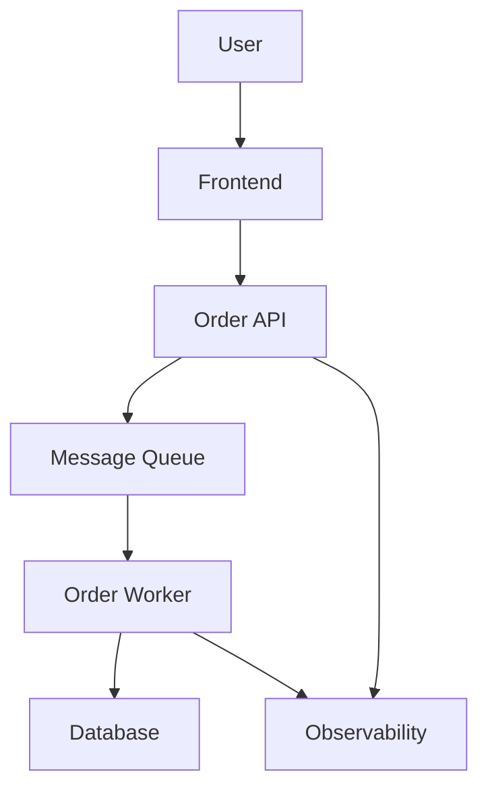

# The platform: OrderFlow

Build a small event-driven order-processing platform:



Use:

* React or an existing frontend
* Python FastAPI or Node/Express API
* Python or Node worker
* PostgreSQL
* SQS semantics through LocalStack where practical
* Docker Compose
* Terraform
* GitHub Actions
* Kubernetes with Kind, Minikube, or Docker Desktop
* Helm and Argo CD
* Prometheus, Grafana and OpenTelemetry
* OPA/Conftest

An AWS account is optional. Terraform supports mocked providers, allowing you to test modules without creating infrastructure or supplying credentials. [Terraform test mocking documentation](https://developer.hashicorp.com/terraform/language/tests/mocking)

# 12-week DevOps engineering backlog

Each week is designed for approximately 8–12 hours.

## Week 1 — Productionize an inherited application

**Scenario:** Developers built the application locally. Your assignment is to make it reproducible for the rest of the team.

**Implementation tickets**

* `OPS-101`: Dockerize the frontend using a multi-stage build.
* `OPS-102`: Dockerize the API and worker.
* `OPS-103`: Create a Docker Compose environment with PostgreSQL.
* `OPS-104`: Add health checks, graceful shutdown and environment-based configuration.
* `OPS-105`: Run containers as non-root users.

**Research spike**

`SPIKE-101: How should production containers be designed?`

Research:

* Multi-stage builds
* PID 1 and signal handling
* `ENTRYPOINT` versus `CMD`
* Image layers and caching
* Distroless versus Alpine versus slim images

Output: a one-page ADR explaining your base-image decision.

**Incident ticket**

The API works on the host but cannot connect to PostgreSQL inside Compose. Diagnose the networking problem and write the root cause.

**Definition of done**

* Entire platform starts with one command.
* No service depends on `localhost` for container-to-container communication.
* Containers restart cleanly.
* README includes startup, test and cleanup commands.

---

## Week 2 — Build the CI pipeline

**Scenario:** Developers are merging code without automated validation.

**Implementation tickets**

* `CICD-201`: Run linting and unit tests for every pull request.
* `CICD-202`: Build all container images.
* `CICD-203`: Tag images using the Git commit SHA.
* `CICD-204`: Cache dependencies and Docker layers.
* `CICD-205`: Create a reusable workflow shared by the API and worker.

**Research spike**

`SPIKE-201: What should block a pull request?`

Compare:

* Unit tests
* Integration tests
* Container builds
* Security scans
* Required approvals
* Branch protection

Output: a proposed quality-gate policy.

**Incident ticket**

The CI build succeeds locally but fails on the GitHub runner because it depends on an undeclared local file.

**Definition of done**

A deliberately broken test, invalid Dockerfile or formatting failure must block the pull request.

---

## Week 3 — Build the event-driven workflow

**Scenario:** Processing orders synchronously is slowing down the API. Move processing to a worker.

**Implementation tickets**

* `EVENT-301`: Make the API publish order events to SQS.
* `EVENT-302`: Build a worker that processes queued messages.
* `EVENT-303`: Add correlation IDs and structured logs.
* `EVENT-304`: Implement idempotent processing.
* `EVENT-305`: Configure retries and a dead-letter queue.

**Research spike**

`SPIKE-301: What delivery guarantees does the system provide?`

Research:

* At-least-once delivery
* Visibility timeout
* Duplicate messages
* Ordering
* Long polling
* Retry backoff
* Poison messages
* Partial batch failures

AWS recommends partial batch responses so successfully processed SQS messages are not unnecessarily retried when another message fails. [AWS Lambda and SQS error-handling documentation](https://docs.aws.amazon.com/lambda/latest/dg/services-sqs-errorhandling.html)

**Incident ticket**

One malformed event repeatedly crashes the worker and prevents useful messages from being processed.

**Definition of done**

* API responds without waiting for processing.
* Duplicate delivery does not create duplicate orders.
* Failed messages eventually reach the DLQ.
* You can trace one order across API and worker logs.

---

## Week 4 — Model the AWS architecture with Terraform

**Scenario:** The company wants a repeatable AWS environment, but deployment approval has not yet been granted.

**Implementation tickets**

* `IAC-401`: Write Terraform for SQS and its DLQ.
* `IAC-402`: Add Lambda, DynamoDB, API Gateway and CloudWatch resources.
* `IAC-403`: Extract reusable queue and Lambda modules.
* `IAC-404`: Add variable validation, outputs and consistent tagging.
* `IAC-405`: Write Terraform tests using mocked AWS providers.

**Research spike**

`SPIKE-401: Lambda or containerized worker?`

Compare:

* Scaling behaviour
* Execution limits
* Cold starts
* Operational effort
* Failure handling
* Cost model
* Workload duration

Produce an ADR with a recommendation rather than simply declaring a winner.

**Incident ticket**

Someone manually modifies a queue setting outside Terraform. Investigate how drift would be detected and reconciled.

**Definition of done**

The following should work without an AWS account:

```bash
terraform fmt -check
terraform init -backend=false
terraform validate
terraform test
```

---

## Week 5 — IAM and deployment identity

**Scenario:** The initial Terraform uses broad permissions and static AWS credentials.

**Implementation tickets**

* `SEC-501`: Create separate roles for the API, worker and deployment pipeline.
* `SEC-502`: Replace wildcard permissions with resource-scoped policies.
* `SEC-503`: Configure a GitHub Actions OIDC trust policy.
* `SEC-504`: Restrict the role to the expected repository, branch or environment.
* `SEC-505`: Document the permission boundaries between components.

GitHub OIDC allows workflows to access AWS without storing long-lived AWS keys in GitHub secrets. [GitHub’s AWS OIDC documentation](https://docs.github.com/actions/deployment/security-hardening-your-deployments/configuring-openid-connect-in-amazon-web-services)

**Research spike**

`SPIKE-501: How does AWS evaluate access?`

Research:

* Identity policies
* Resource policies
* Trust policies
* Permission boundaries
* Service control policies
* Explicit deny
* `iam:PassRole`

**Incident ticket**

The deployment assumes its role successfully but receives `AccessDenied` when updating the Lambda function.

**Definition of done**

* No static AWS access keys are required.
* Every permission can be connected to a specific operation.
* Trust policy does not permit every repository or branch.

---

## Week 6 — Make the platform observable

**Scenario:** Orders occasionally disappear, but the team cannot determine where they failed.

**Implementation tickets**

* `OBS-601`: Add structured JSON logs.
* `OBS-602`: Instrument the API and worker with OpenTelemetry.
* `OBS-603`: Deploy an OpenTelemetry Collector.
* `OBS-604`: Build a dashboard for API latency, failures, queue depth and processing duration.
* `OBS-605`: Define an alert for a growing queue backlog.

The OpenTelemetry Collector provides a vendor-neutral pipeline for receiving, processing and exporting telemetry. [OpenTelemetry Collector documentation](https://opentelemetry.io/docs/collector/)

**Research spike**

`SPIKE-601: What should the service SLO measure?`

Define:

* Availability SLI
* Processing-success SLI
* End-to-end latency SLI
* Target SLO
* Error budget
* Alert thresholds

**Incident ticket**

Introduce a five-second delay in the worker and determine its effect on queue age and end-to-end latency.

**Definition of done**

Using only telemetry, you should be able to answer:

* Which request failed?
* Which component failed?
* When did it fail?
* What was the user impact?

---

## Week 7 — Move the workloads to Kubernetes

**Scenario:** The platform team has standardized application deployments on Kubernetes.

**Implementation tickets**

* `K8S-701`: Create Deployments for the frontend, API and worker.
* `K8S-702`: Add Services for components requiring network access.
* `K8S-703`: Move configuration into ConfigMaps and Secrets.
* `K8S-704`: Configure startup, readiness and liveness probes.
* `K8S-705`: Add resource requests, limits and a PodDisruptionBudget.

**Research spike**

`SPIKE-701: Which Kubernetes controller should own each workload?`

Compare:

* Deployment
* StatefulSet
* Job
* CronJob
* DaemonSet

**Incident ticket**

A bad readiness probe removes every API pod from the Service endpoints even though the containers are running.

**Definition of done**

* Platform runs on a local cluster.
* Configuration changes do not require rebuilding images.
* Unready pods receive no traffic.
* Deleting a pod does not create a user-visible outage.

---

## Week 8 — Implement Gateway API routing

**Scenario:** Infrastructure and application teams need clearly separated traffic-management responsibilities.

**Implementation tickets**

* `NET-801`: Install a Gateway API implementation such as Envoy Gateway.
* `NET-802`: Create a `GatewayClass` and `Gateway`.
* `NET-803`: Route frontend and API traffic using `HTTPRoute`.
* `NET-804`: Add path or header matching.
* `NET-805`: Split traffic between API v1 and v2.

Gateway API supports native weighted traffic splitting between Services. [Gateway API traffic-splitting guide](https://gateway-api.sigs.k8s.io/guides/user-guides/traffic-splitting/)

**Research spike**

`SPIKE-801: Ingress or Gateway API?`

Research:

* Responsibility separation
* Portability
* Controller-specific annotations
* `allowedRoutes`
* `ReferenceGrant`
* TLS termination
* Cross-namespace routing

**Incident ticket**

The `HTTPRoute` exists but is not accepted by the Gateway. Use resource status conditions and controller logs to diagnose it.

**Definition of done**

* Routes report `Accepted=True`.
* API v1 and v2 receive approximately the configured traffic ratio.
* Routing changes require no application-image rebuild.

---

## Week 9 — Autoscaling and resilience

**Scenario:** A traffic spike causes the queue to grow faster than the worker can process it.

**Implementation tickets**

* `SCALE-901`: Configure API scaling using HPA.
* `SCALE-902`: Scale workers from queue-depth metrics using KEDA or a custom metric.
* `SCALE-903`: Add topology-spread constraints.
* `SCALE-904`: Configure safe termination and shutdown periods.
* `SCALE-905`: Create a repeatable load test.

**Research spike**

`SPIKE-901: Which signal should control worker scaling?`

Compare:

* CPU
* Memory
* Queue depth
* Oldest-message age
* Arrival rate
* Processing duration

**Incident ticket**

Generate traffic faster than one worker can process it. Observe scaling, recovery time and whether messages are lost or duplicated.

**Definition of done**

* Workers scale from one replica to multiple replicas.
* Backlog eventually returns to normal.
* Scaling down does not interrupt in-flight processing.

---

## Week 10 — Introduce Helm and GitOps

**Scenario:** Manual `kubectl apply` deployments are causing configuration drift.

**Implementation tickets**

* `GITOPS-1001`: Package the platform as a Helm chart.
* `GITOPS-1002`: Create separate development and production values.
* `GITOPS-1003`: Install Argo CD locally.
* `GITOPS-1004`: Enable automated sync, self-healing and pruning.
* `GITOPS-1005`: Add sync ordering for database migrations.

Argo CD continuously compares live state with the desired state in Git and can reconcile differences automatically. [Argo CD automated-sync documentation](https://argo-cd.readthedocs.io/en/stable/user-guide/auto_sync/)

**Research spike**

`SPIKE-1001: How should GitOps rollbacks work?`

Compare:

* Reverting Git
* Helm rollback
* Image-tag rollback
* Roll-forward fixes
* Database compatibility

**Incident ticket**

Commit an invalid configuration that causes an unhealthy deployment. Recover using Git as the source of truth.

**Definition of done**

Manual changes made with `kubectl` are detected and corrected or clearly reported.

---

## Week 11 — Enforce policy as code

**Scenario:** Reviews repeatedly find privileged containers, missing resource limits and overly permissive Terraform.

**Implementation tickets**

* `POLICY-1101`: Reject Kubernetes workloads using `latest` image tags.
* `POLICY-1102`: Require CPU and memory requests.
* `POLICY-1103`: Require non-root containers.
* `POLICY-1104`: Reject Terraform security groups exposing administrative ports publicly.
* `POLICY-1105`: Reject IAM policies containing unrestricted actions and resources.
* `POLICY-1106`: Add policy unit tests and run them in CI.

OPA supports testing Rego policies and enforcing configuration rules in CI/CD. [OPA policy-testing documentation](https://openpolicyagent.org/docs/policy-testing), [OPA CI/CD guidance](https://openpolicyagent.org/docs/cicd)

**Research spike**

`SPIKE-1101: Where should policy enforcement happen?`

Compare:

* Developer pre-commit
* Pull-request CI
* Kubernetes admission
* Cloud organization policies
* Runtime detection

**Incident ticket**

A developer’s deployment is rejected despite appearing secure. Diagnose whether the policy or workload is wrong and add a regression test.

**Definition of done**

Every policy must include:

* A passing input
* A failing input
* A clear error message
* Unit tests
* Documented reason for the control

---

## Week 12 — Production-readiness game day

**Scenario:** Management wants evidence that OrderFlow can safely enter production.

**Implementation tickets**

* `OPS-1201`: Create an operational-readiness checklist.
* `OPS-1202`: Define RTO and RPO.
* `OPS-1203`: Write backup and restoration procedures.
* `OPS-1204`: Produce a basic monthly cost estimate.
* `OPS-1205`: Write runbooks for the three most likely incidents.
* `OPS-1206`: Conduct a controlled failure exercise.

**Research tickets**

* Single-region versus multi-region deployment
* Managed PostgreSQL versus self-managed PostgreSQL
* Queue retention and DLQ retention
* Secrets rotation
* Dependency and container scanning
* Service quotas and capacity planning
* Build versus buy for monitoring

**Game-day failures**

Inject two or three:

* Bad application release
* Worker unable to access the queue
* PostgreSQL unavailable
* Queue backlog grows rapidly
* Incorrect Gateway route
* Argo CD reports drift

**Final deliverables**

* Architecture diagram
* Terraform modules
* CI/CD workflows
* Kubernetes and Helm code
* OPA policies
* Dashboards
* ADRs
* Incident postmortem
* Production-readiness review
* Five-minute demonstration video

# How to write a proper research ticket

Avoid tickets such as “learn SQS.” That has no completion boundary.

Use this format:

```text
Title:
SPIKE — Select compute platform for the order worker

Context:
The worker processes asynchronous order events. Processing normally
takes 2–10 seconds, but some jobs may take several minutes.

Question:
Should the worker run on Lambda, ECS Fargate or Kubernetes?

Decision criteria:
- Cost at expected volume
- Maximum processing duration
- Scaling speed
- Failure handling
- Operational complexity
- Observability
- Vendor coupling

Timebox:
90 minutes

Deliverable:
One-page ADR containing the options, trade-offs, recommendation,
assumptions and conditions that would cause us to revisit the decision.
```

The purpose of a research spike is to make a decision—not to collect endless notes.

# Weekly operating rhythm

* **Monday:** Read the scenario, refine tickets and draw the expected architecture.
* **Tuesday:** Implement the main happy path.
* **Wednesday:** Add tests and automation.
* **Thursday:** Inject the assigned failure and troubleshoot it.
* **Friday:** Complete the research spike and ADR.
* **Saturday:** Write the runbook, README and postmortem.
* **Sunday:** Record a demo, publish a short technical post and plan the next sprint.

# Definition of done for every week

A project is not complete because the code runs once. It is complete when:

* Another engineer can reproduce it from the README.
* Automated tests verify important behaviour.
* Configuration is separated from code.
* Security decisions are documented.
* Logs or metrics expose its operational state.
* At least one failure has been deliberately tested.
* Cleanup commands are provided.
* A short ADR records the major trade-off.
* The repository contains no credentials.
* You can explain what would change at ten times the traffic.

This system will make you practise implementation, troubleshooting, research, architecture, communication and operational thinking together—which is much closer to actual DevOps work than completing isolated courses.
